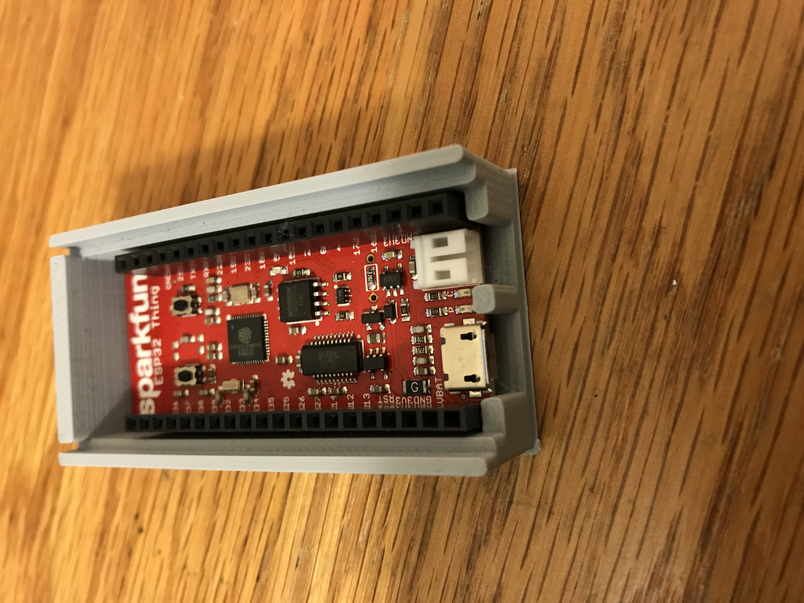

# Final Project - Physical Computing and the Internet of Things

*Name:*  Stephanie Fiddy  

*Date:* 12/14/17

## Project:  Chitech / Esp32 Thing


Chitech is a psychometric IoT device that monitors your dog’s shaking patterns. Chitech is accompanied with the Chitech webapp in which gives you a better insight into the psychology of your pet. 


### Detailed Project Description

Wearable technology in today's consumer market  has expanded to include products tailored to our closest companions, our pets. These devices have given pet owners the ability to closely monitor their furry companions with the hopes of using  the data gathered to improve their pets health and wellness. As a proud owner of a four year old Chihuahua (named Chloe), wearable technology for animals inspired me to construct my own. 

Small dogs, especially Chihuahuas are known to respond to excitement by shaking. From my interest in discovering what excites Chloe the most, my idea for Chitech was born. My product is a non-invasive wearable device tailored for small dogs. This device detects vibrations and transmits that data to the accompanying webapp where pet owners can get a better understanding of their dog's behavioral patterns. 

When the Chitech device detects that the dog is shaking, it transmits that data to the webapp. The webapp then prompts the user to record the nature of the event that triggered the excitable response. Through time, the user is able to analyze the data collected in order to get a deeper understanding of their dog's motivations and preferences. 

There is both a utilitarian and an analytical component to Chitech. My prototype explores how the data collected from our beloved pets is being protected and disseminated by the companies selling these wearable devices. My hopes for this project is to begin a dialog on  privacy rights when related to animal data. Is animal data considered confidential? If it’s confidential, is it shared with other 3rd party companies? And if it is not confidential, then how is animal data usually handled? Where is the data going? I attempt to answer some of these questions in the *Design / Form : Conceptual Engagement* section


### Technical Description

For my project, size was of the upmost importance. Because I needed a device that would comfortably fit on my small dog, I decided to go with the Esp32 thing for various reasons. For one, the 'thing' is one of the smallest microcontrollers on the market. The Esp32 also has wifi compatibility and features a lithium-polymer (LiPo) battery port making it a compact and easily transportable device. Further explanation on the hardware used in and development of this project can be found in the "Hardware Wiring Diagram" sub-section below. 

I also developed a full stack website to support the Chitech product. The website consists of a bootstrap frontend, a flask backend and a sqlite3 database. This webapp provides the user with an interface to log the nature of the event that excited your dog.  I decided to produce a web application because it was the most suitable platform to couple with the physical device. The web's portability and multi-platform use made it the ideal interface for the on-the-go dog owner. 


The Esp32 thing connects with the webapp by sending an HTTP POST request to the flaskapp. The web app receives the post request and is intended to prompt the user to submit the "excitable event" that caused the dog to shake.  I was able to establish the connectivity between the Esp32 thing and the flask web app with very limited success. The arduino device confirms that the "shake value" is posting to the app, but unfortunately the web app does not appear to receive the value. This is likely due to the fact that the libraries for the Esp32 thing is still under development (as noted on the Sparkfun website). However, each individual component works independently and this was the missing piece to my project. 


#### Hardware Wiring Diagram


I chose to use the Esp32 thing because it is small enough to comfortably be attached to my five pound dog, Chloe. There was some prepping involved for getting the esp32 thing ready for use. First of all, I decided to solder some headers onto the microcontroller for easy connection. 

I faced two challenges when working on the hardware. First of all, finding a sensor that accurately and consistenly detected vibrations was extremely challenging. At first I attempted to use an uncovered and covered Piezo Element, running multiple trials and comparing the results from each sensor. Despite countless trials, the piezo element continued to give variable and unrealiable vibration readings. 

The Piezo Vibration Sensor proved to the most adequate sensor for Chitech since it accurately detected vibrations when the device was shaken. However the Piezo Vibration Sensor proved to only accurately detect a standard "shake" when it had a weight attached to it. As a solution to this problem, I chose to tape two nails onto the sensor since the nails were compact and heavy enough to product consistent results. I chose to tape the nails instead of gluing them for fear that the latter would potentially ruin the sensor. 

#### Code - Arduino 

Please refer to [chitech.ino](code/chitech.ino) for the complete code that I used on the arduino. 

In order to get the vibration sensor properly working, I first read the Piezo Vibration sensor's ADC value in and converted in into a voltage:  
```c
// Within the void loop() function
  int piezoADC = analogRead(PIEZO_PIN);
  float piezoV = piezoADC / 1023.0 * 5.0;
```

Since I calibrated the ADC value coming from the Piezo sensor, a "shake" was detected if the **piezoV** value was greater than 0.00. If the value was greater than 0, then the shakeValue of **1** would be posted to the flask app. I used the **WiFiClient** and **ArduinoHTTPClient** libraries for supporting the POST request transmission. 

```c
#include <WiFi.h>
#include <WiFiClient.h>
#include <WiFiServer.h>
#include <WiFiUdp.h>

#include <ArduinoHttpClient.h>

// ... other code not shown
  if (piezoV > 0.00 ) {
      Serial.println("Shake detected. Commencing Post...");
      PostData = "{\"id\": \"2\", \"shakeValue\": \"1\"}";
      Serial.println("making POST request");
    
      client.beginRequest();
      client.post("/postjson");
      client.sendHeader("Content-Type", "application/json");
      client.sendHeader("Content-Length", PostData.length());
      client.sendHeader("X-Custom-Header", "custom-header-value");
      client.beginBody();
      client.print(PostData);
      client.endRequest();
      Serial.println("Post Request Made");
      // read the status code and body of the response
      statusCode = client.responseStatusCode();
      response = client.responseBody();
    
      Serial.print("Status code: ");
      Serial.println(statusCode);
      Serial.print("Response: ");
      Serial.println(response);
    
      Serial.println("Wait five seconds");
      delay(5000);
  }
```
#### Code - Flask Web App
Please refer to [app.py](code/flaskwebapp/app.py) for the routing code that I used for the flask app. Please see the folder *flaskwebapp* for the entire web project. Note - there were too many flask libraries to upload to github. Therefore, I have not included the standard files that are imported when you setup flask. 

The web app is composed of three separate components:

1. Frontend: Bootstrap
2. Backend: Flask
3. Database: Sqlite3


##### Frontend: Bootstrap

After completing the flask setup process (which entailed downloading the flask libraries and setting up the proper file hiearachy), I imported bootstrap to the proper files. 

This included importing the module into the **app.py** file and initializing the Bootstrap object:

```python
# from app.py file
from flask_bootstrap import Bootstrap
# ...
Bootstrap(app)
```

I also imported the bootstraps modules in the html files. Bootstrap/wtf is the module that allows forms to be generated with flask and a bootstrap frontend:

```html


```

##### Backend: Flask

For the sake of brevity, I will not go into detail on how I set up flask. Here I will explain how I generated the forms with flask and the process in which I used for the POST request. 

For generating the forms, I created a new route function **postJsonHandler()** that receives the HTTP post request and renders the form template. I start by adding the 'GET' & 'POST' methods to the route function and reading in the HTTP post request with the .get_json() function. If the request method is a POST, I create a new event that generates a new row under the unique user (queried by "id"). 

The form is created by calling the EEForm() function and rendered to jsonpost.html

```python
# Post Route
@app.route('/postjson', methods = ['GET', 'POST'])
def postJsonHandler():
     content = request.get_json()
      # EE Form
     form = EEForm()

     if request.method == 'POST':
	     val = content['shakeValue']
	     other_val = content['id']

	     events = EventTable.query.all()
# ....

	     new_event = EventTable(id=1, user_id=current_user, toy=0, treat=0, praise=int(val))
# ....
	     return render_template('jsonpost.html',form=form, events=events, val=int(val))

```


##### Database: Sqlite3

In order to user sqlite3 with flask, I imported the SQLAlchemy module and initiliazed the database (named **db**): 

```python
from flask_sqlalchemy import SQLAlchemy
# ...
app.config["SECRET_KEY"] = 'Thisismysecretkey'
app.config['SQLALCHEMY_DATABASE_URI'] = 'sqlite:////Users/steph/Dropbox/Academic/Duke/_Fall-2017/projects/myflaskapp/database.db'
db = SQLAlchemy(app)
```

I first created the SQL database table with the columns id, user_id, toy, treat and praise:

```python
class EventTable(db.Model):
	__tablename__ = 'event'
	id = db.Column(db.Integer, primary_key=True)
	user_id = db.Column(db.Integer, db.ForeignKey('user.id'))
	toy = db.Column(db.Integer)
	treat = db.Column(db.Integer)
	praise = db.Column(db.Integer)
```

I then generated the Form fields and rendered the template to jsonpost.html (see postJSONHandler for rendering):

```python
class EEForm(FlaskForm):
	exitableEvent = RadioField('Excitable Events', validators=[InputRequired(), Length(max=6)], choices = [('treat','treat'),('toy','toy'), ('praise', 'praise')])	
```


### Design / Form : Aesthetic Choices 

As mentioned earlier in this Readme file, the size of the final product was of the upmost importance. Because of this, I chose to print an enclosure with a simple aesthetic. I chose to go with 3d printing a small box that was large enough to contain the Esp32 thing and the sensor.



I used a 'slide in' closing method to secure the top of the enclosure. Also, since this device has the option to be battery powered, I decided to dedicate a space for the battery enclosure on this top portion. The battery's position allows it to be easily plugged it and the battery does not come in contact with the dog's skin (reducing potential discomfort to the animal). 


With regards to the harness, I decided to go with a knit elastic because the strechy material would reduce discomfort for Chloe. In addition the elastic wrap makes it easy to adjust the device and allows the pet owner to strap it on as tightly as they please. 


### Design / Form : Conceptual Engagement


The handling and transmission of data collected from wearable technology is too often an afterthought to the consumer. I surrounded my enclosure with the privacy rights of a popular biometric collar for dogs, [PetPace](https://petpace.com/privacy-policy/). My choice for this aesthetic was to remind the consumer of the implications of using this technology. By pasting the privacy rights on the physical enclosure I challenge the user to contemplate the freedom they relinquish on any data collected from the device. 

Examples of some of the excerpts you will find in the enclosure are the following adpated from PetPace's Privacy Policy:

For one, Pets' data is considered as non-confidential information --despite the fact that PetPace is a biometric technology that collects health related data to your pet. 
> Pets' Data is non-identifiable nor shall be considered as peronsal information. Such information shall be deemed to be non-confidential.

Additionally, the company is distribute to use that data at their own discretion:
> Pets Data may also be used by us for performing future research, enhancing our products capabilities or for any other purpose, commerciail or otherwise and **may be freely displayed, shared or sold by us.**

With the increasing evolution of technology, policies such as those detailed above are concerning. As technology gets more sophisticated, at what point would pets' data be protected? 

### Evaluation / Reflection

This project was an enriching experience. I have gained an arsenal of new skills from undergoing the process entailing the creation of Chitech. For one, I have gained invaluable knowledge on the nuances of 3D printing --especially when printing objects with enclosures as small as mine. It took 5 iterations of 3D printing just to achieve the desired size and fit for the circuitry. 

Personally howevver, the most valuable skill that I gained from this project is that it gave me the opportunity to create my first full stack website. This project gave me the opportunity to tinker with the site's backend and storage infrastructure, which I had never done before. I now have a deeper understanding on the intereactions between these different components that constitutes a web app. 

I am extremely satisfied with the outcome of my Chitech project and how the different aspects of the project came into fruition. In future projects where perhaps the size of the device is irrelevant, I would allocate more time researching the capabilities and limitations of the devices. I would focus my research on the capabilities of integration in a webapp.For instance, with the Sparkfun Photon, I was easily able to execute an HTTP post request but it proved extremely difficult to perform the same function in the Esp32 thing. 

Overall I had a great time doing this project and I plan on expanding upon it in the future for my own use! 
